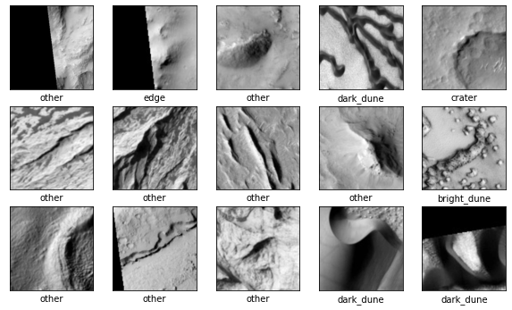
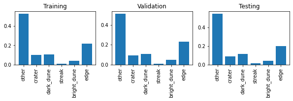
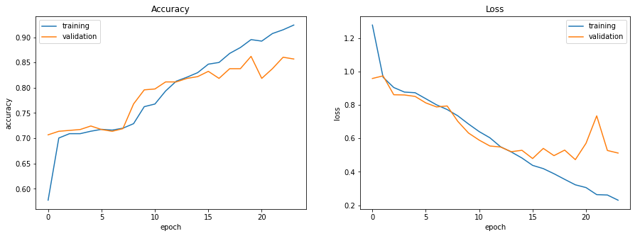
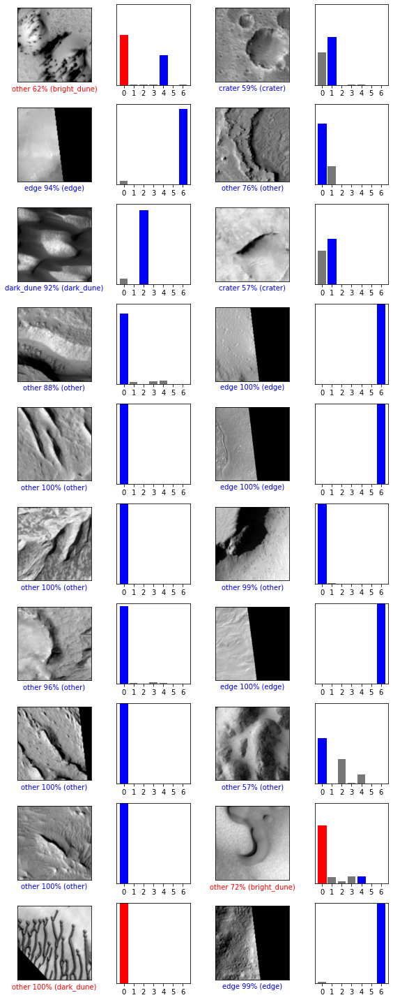
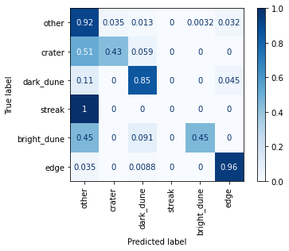

# Mars Surface Image Classification
## Optimizing CNN Hyperparameters with Hyperband


The HiRise Orbital Dataset (add reference) consists of 3820 grayscale 227x227 JPEG images of the Mars surface. Each image is cropped from one of 168 larger images taken by the High Resolution Imaging Science Experiment (HiRise) camera onboard the Mars Reconnaisance Orbiter. Wagstaff et al created this dataset for the purpose of training a CNN to categorize landmarks on the Mars surface. The network could then be deployed to enable content-based searching of the images on NASA's Planetary Data System (PDS). (*** add a few image examples somewhere***)

The authors' final published network achieved 90% accuracy on their test set. Since the size of the dataset is relatively small, the authors used transfer learning. They fine-tuned AlexNet, a state-of-the-art CNN trained on 1.2 million images from 1000 classes (ImageNet) (***add citation to AlexNet paper***)

For this experiment, we will test the effectiveness of the transfer learning approach by training a network from scratch using solely the HiRise dataset. We will tune hyperparameters by defining a hyperparameter space and performing a random search. The most effective set of hyperparameters from the search will be used in our final model.


We begin by importing the required modules. These include:
* Tensorflow and Keras for building and training the CNN
* Keras Tuner for optimizing hyperparameters
* NumPy
* matplotlib.pyplot for visualizations
* A few other helpful utilities


```python
from tensorflow import keras
from tensorflow.keras import layers
!pip install -U keras-tuner
from kerastuner.tuners import RandomSearch
import numpy as np
import matplotlib.pyplot as plt

from urllib.request import urlopen
from PIL import Image
from tqdm import tqdm
from sklearn.model_selection import train_test_split
from sklearn.metrics import confusion_matrix, ConfusionMatrixDisplay
import IPython
```

    Requirement already up-to-date: keras-tuner in /usr/local/lib/python3.6/dist-packages (1.0.1)
    Requirement already satisfied, skipping upgrade: scikit-learn in /usr/local/lib/python3.6/dist-packages (from keras-tuner) (0.22.2.post1)
    Requirement already satisfied, skipping upgrade: numpy in /usr/local/lib/python3.6/dist-packages (from keras-tuner) (1.18.5)
    Requirement already satisfied, skipping upgrade: tqdm in /usr/local/lib/python3.6/dist-packages (from keras-tuner) (4.41.1)
    Requirement already satisfied, skipping upgrade: tabulate in /usr/local/lib/python3.6/dist-packages (from keras-tuner) (0.8.7)
    Requirement already satisfied, skipping upgrade: future in /usr/local/lib/python3.6/dist-packages (from keras-tuner) (0.16.0)
    Requirement already satisfied, skipping upgrade: terminaltables in /usr/local/lib/python3.6/dist-packages (from keras-tuner) (3.1.0)
    Requirement already satisfied, skipping upgrade: requests in /usr/local/lib/python3.6/dist-packages (from keras-tuner) (2.23.0)
    Requirement already satisfied, skipping upgrade: colorama in /usr/local/lib/python3.6/dist-packages (from keras-tuner) (0.4.3)
    Requirement already satisfied, skipping upgrade: scipy in /usr/local/lib/python3.6/dist-packages (from keras-tuner) (1.4.1)
    Requirement already satisfied, skipping upgrade: joblib>=0.11 in /usr/local/lib/python3.6/dist-packages (from scikit-learn->keras-tuner) (0.16.0)
    Requirement already satisfied, skipping upgrade: certifi>=2017.4.17 in /usr/local/lib/python3.6/dist-packages (from requests->keras-tuner) (2020.6.20)
    Requirement already satisfied, skipping upgrade: idna<3,>=2.5 in /usr/local/lib/python3.6/dist-packages (from requests->keras-tuner) (2.10)
    Requirement already satisfied, skipping upgrade: urllib3!=1.25.0,!=1.25.1,<1.26,>=1.21.1 in /usr/local/lib/python3.6/dist-packages (from requests->keras-tuner) (1.24.3)
    Requirement already satisfied, skipping upgrade: chardet<4,>=3.0.2 in /usr/local/lib/python3.6/dist-packages (from requests->keras-tuner) (3.0.4)


---


## **Data Import and Preprocessing**

The dataset includes two files and a folder of images. The first file, `landmarks_mp.py`, contains a dictionary for mapping the numeric class labels to the class names. We'll add this to the execution environment for later use.


```python
class_map = {0: 'other',
             1: 'crater',
             2: 'dark_dune',
             3: 'streak',
             4: 'bright_dune',
             5: 'impact',
             6: 'edge'}
```

The second file, `labels-map-proj.txt`, contains each image filename along with its correspondong class label, separated by a space. The first task is to partition these lines randomly into the training, validation, and test sets. We use the same proportions as the original authors: 70%, 15%, and 15% for the training, validation, and test sets, respectively.


```python
lines = urlopen('https://ajndata.s3.us-east-2.amazonaws.com/hirise/labels-map-proj.txt').read().decode('utf-8').strip().split('\n')
#lines = file.readlines()
#file.close()

train, not_train = train_test_split(lines, train_size=0.7)
val, test = train_test_split(not_train, test_size=0.5)
```

Next, we import the image data and store them and the labels in NumPy arrays.


```python
img_url = 'https://ajndata.s3.us-east-2.amazonaws.com/hirise/map-proj/'

def get_image(url):
  image = Image.open(urlopen(url))
  return np.array(image)

def get_set(lines):
  images = []
  labels = []

  for line in tqdm(lines):
    filename, label = line.split(' ')
    images.append(get_image(img_url + filename))
    labels.append(int(label))

  images = np.array(images)
  labels = np.array(labels)

  return images, labels


print("Importing training set...")
train_images, train_labels = get_set(train)

print()
print("Importing validation set...")
val_images, val_labels = get_set(val)

print()
print("Importing test set...")
test_images, test_labels = get_set(test)
```

    Importing training set...


    100%|██████████| 2674/2674 [19:40<00:00,  2.26it/s]


    
    Importing validation set...


    100%|██████████| 573/573 [04:12<00:00,  2.27it/s]


    
    Importing test set...


    100%|██████████| 573/573 [04:12<00:00,  2.27it/s]


Let's have a look at the range of pixel values in the data.


```python
print(train_images.min(), train_images.max())
```

    0 255


This is the standard scaling for pixel intensity in JPEG images. Before feeding them to the network, we want to normalize these values to be in the range [0,1].


```python
train_images = train_images/255.0
val_images = val_images/255.0
test_images = test_images/255.0
```

Using the image data and the previously defined class map, we can plot some of the images to get an idea of the types of images we are dealing with. 


```python
plt.figure(figsize=(10,10))
for i in range(15):
    plt.subplot(5,5,i+1)
    plt.xticks([])
    plt.yticks([])
    plt.grid(False)
    plt.imshow(train_images[i], cmap=plt.cm.binary_r)
    plt.xlabel(class_map[train_labels[i]])
plt.show()
```





The edge category seems like it may be more common than the others. Let's take a look at the distribution of the labels in the training set. 


```python
def plot_class_dist(labels, title):
  classes, counts = np.unique(labels, return_counts=True)
  classes = [class_map[label] for label in classes]
  normalized_counts = (counts/counts.sum())
  plt.bar(classes, normalized_counts)
  plt.title(title)
  plt.xticks(rotation=90)


plt.figure(figsize=(10,2))
plt.subplot(1,3,1)
plot_class_dist(train_labels, 'Training')
plt.subplot(1,3,2)
plot_class_dist(val_labels, 'Validation')
plt.subplot(1,3,3)
plot_class_dist(test_labels, 'Testing')
plt.show()
```





Before we can start training the neural net, there is one last step. If we look at the shape of the image data, we see that each example is a 227x227 array.


```python
print(train_images.shape, val_images.shape, test_images.shape)
```

    (2674, 227, 227) (573, 227, 227) (573, 227, 227)


The Keras Conv2D layer expects each training example to be a 3D tensor in which the first two dimensions are the length and width of the image, and the third dimension is the number of channels. Since these are grayscale images, they only have a single channel. We can simply reshape the arrays to add this dimension.


```python
train_images = train_images.reshape((train_images.shape[0],227,227,1))
val_images = val_images.reshape((val_images.shape[0],227,227,1))
test_images = test_images.reshape((test_images.shape[0],227,227,1))

print(train_images.shape, val_images.shape, test_images.shape)
```

    (2674, 227, 227, 1) (573, 227, 227, 1) (573, 227, 227, 1)


---
# Define a Hyperparameter Space and a Model Building Function


The first layer will be a convolutional layer with either 32, 64, 96, or 128 filters. The filter size for this layer will be either 3x3, 5x5, or 11x11, and the stride will be either 1 or 2. We will also allow for an even larger stride of 4 in cases where the 11x11 filter is chosen (The first layer of AlexNet consists of 11x11 filters with a stride of 4, so I wanted to make sure this combination was included in the search space). This layer is followed by a 2x2 max pool.

The first convolutional layer will be followed by between one and four additional convulutional layers. These layers can also have either 32, 64, 96, or 128 filters. Filter size can be 3x3 or 5x5, and the stride will be 1. Only the final layer from this group will be followed by a max pool.

There may be anywhere between one and four fully connected layers after the last max pool, and each of these layers can have a minimum of 64 and a maximum of 512 neurons. Additionally, each fully connected layer is optionally followed by a 50% dropout layer. 

The final layer in the model is a softmax layer which will output the predicted probabilities for each class. 

We will also add two learning rates (0.001 and 0.0001) and two optimizer choices (Adam and RMSProp) to the hyperparameter space. These learning rates and optimizers have proven effective on this dataset during initial experiments.

The following code block is model building function that defines the above hyperparemeter space for the `keras tuner`.


```python
def build_model(hp):
    model = keras.Sequential()

    # convolutional / max pooling layers
    # For first layer, only make large stride of 4 possible if filter size is 11x11
    layer_1_filtersize = hp.Choice('filtersize_1', values=[3,5,11])
    if layer_1_filtersize == 11:
      possible_strides = [1,2,4]
    else:
      possible_strides = [1,2]
    model.add(layers.Conv2D(hp.Choice('filters_1', values=[32,64,96,128]),
                            layer_1_filtersize, 
                            strides=hp.Choice('strides_1', values=possible_strides),
                            activation='relu',
                            input_shape=train_images.shape[1:]))

    model.add(layers.MaxPooling2D((2,2)))

    # Up to 4 additional conv layers
    for i in range(hp.Int('num_conv_layers', 1, 4)):
      model.add(layers.Conv2D(hp.Choice('filters_' + str(i+2), values=[32,64,96,128]),
                              hp.Choice('filtersize_' + str(i+2), values=[3,5]), 
                              activation='relu'))

    model.add(layers.MaxPooling2D((2,2)))
    model.add(layers.Flatten())


    # fully connected layers (up to four) 
    for i in range(hp.Int('num_dense_layers', 1, 4)):
      model.add(layers.Dense(units=hp.Int('dense_units_' + str(i+1),
                                          min_value=64,
                                          max_value=512,
                                          step=64),
                                          activation='relu'))
      if hp.Choice('dropout_dense_' + str(i+1), values=[True,False], default=False):
        model.add(layers.Dropout(0.5))         

    # output softmax layer
    model.add(layers.Dense(7, activation='softmax'))

    # learning rate & optimizer
    learning_rate = hp.Choice('learning_rate', values=[0.001, 0.0001])
    
    if hp.Choice('optimizer', values=['adam', 'rmsprop']) == 'adam':
      model.compile(optimizer=keras.optimizers.Adam(learning_rate),
          loss='sparse_categorical_crossentropy',
          metrics=['accuracy'])
    else:
      model.compile(optimizer=keras.optimizers.RMSprop(learning_rate),
          loss='sparse_categorical_crossentropy',
          metrics=['accuracy'])

    return model
```

This function is used to initialize the random search tuner. We'll instruct the tuner select the hyperparameters that produce the highest validation accuracy during the tuning process. We'll tell it to try 40 different sets of hyperparameters, and repeat each trial three times for a higher degree of reliability.


```python
tuner = RandomSearch(
    build_model,
    objective='val_accuracy',
    max_trials=30,
    executions_per_trial=3,
    overwrite=True,
    project_name='mars_trials')

# Uncomment to view summary of search space
# tuner.search_space_summary()
```

This callback function will clear the output after each trial.


```python
class ClearTrainingOutput(keras.callbacks.Callback):
  def on_train_end(*args, **kwargs):
    IPython.display.clear_output(wait = True)

```

Finally, we let the tuner work its magic. Each trial can be up to 30 epochs (in initial experiments, the network tended to converge in less than 20 epochs). We'll also pass an early stopping callback to halt training early if validation loss begins to increase.


```python
tuner.search(train_images, train_labels, 
             validation_data=(val_images, val_labels),
             epochs=30,
             callbacks=[ClearTrainingOutput()])
```


<span style="color:#4527A0"><h1 style="font-size:18px">Trial complete</h1></span>


<span style="color:#4527A0"><h1 style="font-size:18px">Trial summary</h1></span>


<span style="color:cyan"> |-Trial ID: 04823412f9bb23c8b3dafc01fe7c80eb</span>


<span style="color:cyan"> |-Score: 0.8440954089164734</span>


<span style="color:cyan"> |-Best step: 0</span>


<span style="color:#7E57C2"><h2 style="font-size:16px">Hyperparameters:</h2></span>


<span style="color:cyan"> |-dense_units_1: 256</span>


<span style="color:blue"> |-dense_units_2: 128</span>


<span style="color:cyan"> |-dense_units_3: 64</span>


<span style="color:blue"> |-dense_units_4: 384</span>


<span style="color:cyan"> |-dropout_dense_1: 1</span>


<span style="color:blue"> |-dropout_dense_2: 1</span>


<span style="color:cyan"> |-dropout_dense_3: 1</span>


<span style="color:blue"> |-dropout_dense_4: 1</span>


<span style="color:cyan"> |-filters_1: 96</span>


<span style="color:blue"> |-filters_2: 64</span>


<span style="color:cyan"> |-filters_3: 96</span>


<span style="color:blue"> |-filters_4: 96</span>


<span style="color:cyan"> |-filters_5: 128</span>


<span style="color:blue"> |-filtersize_1: 3</span>


<span style="color:cyan"> |-filtersize_2: 3</span>


<span style="color:blue"> |-filtersize_3: 3</span>


<span style="color:cyan"> |-filtersize_4: 5</span>


<span style="color:blue"> |-filtersize_5: 5</span>


<span style="color:cyan"> |-learning_rate: 0.001</span>


<span style="color:blue"> |-num_conv_layers: 2</span>


<span style="color:cyan"> |-num_dense_layers: 3</span>


<span style="color:blue"> |-optimizer: rmsprop</span>


<span style="color:cyan"> |-strides_1: 2</span>


    INFO:tensorflow:Oracle triggered exit


Now we retrieve the set of hyperparameters that achieved the highest performance during the tuning.


```python
best_hp = tuner.get_best_hyperparameters()[0]

best_model = tuner.hypermodel.build(best_hp)

best_model.summary()

```

    Model: "sequential"
    _________________________________________________________________
    Layer (type)                 Output Shape              Param #   
    =================================================================
    conv2d (Conv2D)              (None, 109, 109, 32)      3904      
    _________________________________________________________________
    max_pooling2d (MaxPooling2D) (None, 54, 54, 32)        0         
    _________________________________________________________________
    conv2d_1 (Conv2D)            (None, 52, 52, 32)        9248      
    _________________________________________________________________
    conv2d_2 (Conv2D)            (None, 48, 48, 96)        76896     
    _________________________________________________________________
    max_pooling2d_1 (MaxPooling2 (None, 24, 24, 96)        0         
    _________________________________________________________________
    flatten (Flatten)            (None, 55296)             0         
    _________________________________________________________________
    dense (Dense)                (None, 320)               17695040  
    _________________________________________________________________
    dropout (Dropout)            (None, 320)               0         
    _________________________________________________________________
    dense_1 (Dense)              (None, 320)               102720    
    _________________________________________________________________
    dropout_1 (Dropout)          (None, 320)               0         
    _________________________________________________________________
    dense_2 (Dense)              (None, 384)               123264    
    _________________________________________________________________
    dense_3 (Dense)              (None, 192)               73920     
    _________________________________________________________________
    dense_4 (Dense)              (None, 7)                 1351      
    =================================================================
    Total params: 18,086,343
    Trainable params: 18,086,343
    Non-trainable params: 0
    _________________________________________________________________


The summary above does not include the stride for the first convolutional layer, the filter sizes for all convolutional layers, the learning rate, or the optimizer. We can retrieve each of these hyperparemeter selections as follows:


```python

# Get filter sizes
for i in range(best_hp.get('num_conv_layers')+1):
  filter_size = best_hp.get('filtersize_' + str(i+1))
  print('Filter Size (conv layer {}): {}x{}'.format(i+1, filter_size, filter_size))

print('Stride (conv layer 1): ', best_hp.get('strides_1'))
print('Learning Rate: ', best_hp.get('learning_rate'))
print('Optimizer: ', best_hp.get('optimizer'))
```

    Filter Size (conv layer 1): 11x11
    Filter Size (conv layer 2): 3x3
    Filter Size (conv layer 3): 5x5
    Stride (conv layer 1):  2
    Learning Rate:  0.0001
    Optimizer:  rmsprop


***Verbal description of model and hyperparameters...***

## Training

Now it is time to train the final model. Again, we pass an early stopping callback to optimize the number of epochs.


```python
history = best_model.fit(train_images, train_labels, epochs=30,
                validation_data=(val_images, val_labels),
                callbacks=[keras.callbacks.EarlyStopping(monitor='val_loss', patience=4)])
```

    Epoch 1/30
    84/84 [==============================] - 2s 19ms/step - loss: 1.2772 - accuracy: 0.5774 - val_loss: 0.9578 - val_accuracy: 0.7068
    Epoch 2/30
    84/84 [==============================] - 1s 16ms/step - loss: 0.9653 - accuracy: 0.7004 - val_loss: 0.9733 - val_accuracy: 0.7138
    Epoch 3/30
    84/84 [==============================] - 1s 17ms/step - loss: 0.9037 - accuracy: 0.7091 - val_loss: 0.8605 - val_accuracy: 0.7155
    Epoch 4/30
    84/84 [==============================] - 1s 17ms/step - loss: 0.8765 - accuracy: 0.7091 - val_loss: 0.8592 - val_accuracy: 0.7173
    Epoch 5/30
    84/84 [==============================] - 1s 17ms/step - loss: 0.8726 - accuracy: 0.7139 - val_loss: 0.8504 - val_accuracy: 0.7243
    Epoch 6/30
    84/84 [==============================] - 1s 17ms/step - loss: 0.8367 - accuracy: 0.7177 - val_loss: 0.8118 - val_accuracy: 0.7173
    Epoch 7/30
    84/84 [==============================] - 1s 17ms/step - loss: 0.8003 - accuracy: 0.7162 - val_loss: 0.7876 - val_accuracy: 0.7138
    Epoch 8/30
    84/84 [==============================] - 1s 17ms/step - loss: 0.7721 - accuracy: 0.7199 - val_loss: 0.7934 - val_accuracy: 0.7190
    Epoch 9/30
    84/84 [==============================] - 1s 16ms/step - loss: 0.7343 - accuracy: 0.7289 - val_loss: 0.7010 - val_accuracy: 0.7679
    Epoch 10/30
    84/84 [==============================] - 1s 17ms/step - loss: 0.6854 - accuracy: 0.7625 - val_loss: 0.6314 - val_accuracy: 0.7958
    Epoch 11/30
    84/84 [==============================] - 1s 17ms/step - loss: 0.6400 - accuracy: 0.7678 - val_loss: 0.5891 - val_accuracy: 0.7976
    Epoch 12/30
    84/84 [==============================] - 1s 17ms/step - loss: 0.6031 - accuracy: 0.7936 - val_loss: 0.5540 - val_accuracy: 0.8115
    Epoch 13/30
    84/84 [==============================] - 1s 17ms/step - loss: 0.5492 - accuracy: 0.8130 - val_loss: 0.5479 - val_accuracy: 0.8115
    Epoch 14/30
    84/84 [==============================] - 1s 16ms/step - loss: 0.5184 - accuracy: 0.8209 - val_loss: 0.5199 - val_accuracy: 0.8185
    Epoch 15/30
    84/84 [==============================] - 1s 17ms/step - loss: 0.4822 - accuracy: 0.8298 - val_loss: 0.5282 - val_accuracy: 0.8220
    Epoch 16/30
    84/84 [==============================] - 1s 16ms/step - loss: 0.4381 - accuracy: 0.8467 - val_loss: 0.4790 - val_accuracy: 0.8325
    Epoch 17/30
    84/84 [==============================] - 1s 16ms/step - loss: 0.4187 - accuracy: 0.8500 - val_loss: 0.5396 - val_accuracy: 0.8185
    Epoch 18/30
    84/84 [==============================] - 1s 16ms/step - loss: 0.3881 - accuracy: 0.8680 - val_loss: 0.4963 - val_accuracy: 0.8377
    Epoch 19/30
    84/84 [==============================] - 1s 17ms/step - loss: 0.3545 - accuracy: 0.8796 - val_loss: 0.5294 - val_accuracy: 0.8377
    Epoch 20/30
    84/84 [==============================] - 1s 17ms/step - loss: 0.3218 - accuracy: 0.8953 - val_loss: 0.4724 - val_accuracy: 0.8621
    Epoch 21/30
    84/84 [==============================] - 1s 17ms/step - loss: 0.3053 - accuracy: 0.8923 - val_loss: 0.5702 - val_accuracy: 0.8185
    Epoch 22/30
    84/84 [==============================] - 1s 17ms/step - loss: 0.2631 - accuracy: 0.9073 - val_loss: 0.7342 - val_accuracy: 0.8377
    Epoch 23/30
    84/84 [==============================] - 1s 17ms/step - loss: 0.2609 - accuracy: 0.9147 - val_loss: 0.5272 - val_accuracy: 0.8604
    Epoch 24/30
    84/84 [==============================] - 1s 17ms/step - loss: 0.2300 - accuracy: 0.9241 - val_loss: 0.5118 - val_accuracy: 0.8569


*** comment on validation accuracy ***

Let's visualize the training history. The following code, adapted from [Jason Brownlee's article](https://machinelearningmastery.com/display-deep-learning-model-training-history-in-keras/), plots loss and accuracy as a function of epochs for both the training and validation sets.


```python

plt.figure(figsize=(15,5))
plt.subplot(1,2,1)
plt.plot(history.history['accuracy'])
plt.plot(history.history['val_accuracy'])
plt.title('Accuracy')
plt.ylabel('accuracy')
plt.xlabel('epoch')
plt.legend(['training', 'validation'], loc='upper left')

plt.subplot(1,2,2)
plt.plot(history.history['loss'])
plt.plot(history.history['val_loss'])
plt.title('Loss')
plt.ylabel('loss')
plt.xlabel('epoch')
plt.legend(['training', 'validation'], loc='upper right')

plt.show()

```





*** comment on graphs ***


## Evaluation

Now for the moment of truth: evaluating the model's accuracy on the test set.**bold text**


```python
test_loss, test_accuracy = best_model.evaluate(test_images, test_labels)
print(test_accuracy)
```

    18/18 [==============================] - 0s 8ms/step - loss: 0.6808 - accuracy: 0.8447
    0.8446771502494812


*** comment on performance, compare to Wagstaff ***

## Prediction

We'll conclude by visualizing the model's decisions. We pass the test image data to the model's `predict` function to get the predicted class probabilities for each example.


```python
predictions = best_model.predict(test_images)
```

To plot the images, we need to remove the extra channel dimension we added earlier.


```python
test_images_2d = test_images.reshape((test_images.shape[:-1]))
```

Using code from [this TensorFlow tutorial](https://www.tensorflow.org/tutorials/keras/classification), we visualize the first 10 predictions.


```python
def plot_image(i, predictions_array, true_label, img):
  predictions_array, true_label, img = predictions_array, true_label[i], img[i]
  plt.grid(False)
  plt.xticks([])
  plt.yticks([])

  plt.imshow(img, cmap=plt.cm.binary_r)

  predicted_label = np.argmax(predictions_array)
  if predicted_label == true_label:
    color = 'blue'
  else:
    color = 'red'

  plt.xlabel("{} {:2.0f}% ({})".format(class_map[predicted_label],
                                100*np.max(predictions_array),
                                class_map[true_label]),
                                color=color)

def plot_value_array(i, predictions_array, true_label):
  predictions_array, true_label = predictions_array, true_label[i]
  plt.grid(False)
  plt.xticks(range(7))
  plt.yticks([])
  thisplot = plt.bar(range(7), predictions_array, color="#777777")
  plt.ylim([0, 1])
  predicted_label = np.argmax(predictions_array)

  thisplot[predicted_label].set_color('red')
  thisplot[true_label].set_color('blue')

num_rows = 10
num_cols = 2
num_images = num_rows*num_cols
plt.figure(figsize=(2*2*num_cols, 2*num_rows))
for i in range(num_images):
  plt.subplot(num_rows, 2*num_cols, 2*i+1)
  plot_image(i, predictions[i], test_labels, test_images_2d)
  plt.subplot(num_rows, 2*num_cols, 2*i+2)
  plot_value_array(i, predictions[i], test_labels)
plt.tight_layout()
plt.show()
  
```





*** comment on predictions ***


```python
pred_labels = predictions.argmax(axis=1)

cm = confusion_matrix(test_labels, pred_labels, normalize='true')
display_labels = np.unique(np.concatenate((test_labels, pred_labels)))
display_labels = [class_map[label] for label in display_labels]
disp = ConfusionMatrixDisplay(confusion_matrix=cm, display_labels=display_labels)
disp = disp.plot(cmap='Blues', xticks_rotation='vertical')
plt.show()
```




